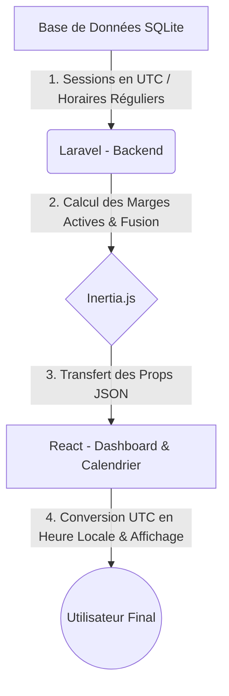

# 📑 Fiche de Mission : Programme du Jour & Calendrier Général

Cette fiche détaille le fonctionnement, l'architecture globale, les défis techniques (du haut en bas) et le processus complet de correction pour dynamiser le tableau de bord et implémenter le calendrier général.

---

## 1. Analyse du Problème : Du Haut en Bas

Pour faire fonctionner cette fonctionnalité de manière premium et robuste, nous devons connecter plusieurs couches de l'application.



### A. La Couche Base de Données (Le défi de l'hétérogénéité)
Nos cours sont organisés selon deux types de planification :
- **Mode régulier (Horaires récurrents)** : Stockés dans la table `cours_horaires`. Ils représentent des créneaux hebdomadaires récurrents (ex: *Chaque mardi de 14h à 16h*). Ils n'ont pas de date calendrier spécifique, seulement un index de jour de semaine (`jour_semaine` de 0 à 6) et des chaînes d'heures (`heure_debut` et `heure_fin`).
- **Mode flexible (Sessions datées)** : Stockés dans la table `cours_sessions`. Ils représentent des cours individuels à une date et heure précises (ex: *Le 21 mai 2026 à 14h00 UTC*), avec une durée en minutes (`duree_minutes`).

### B. Le Défi de la "Marge de Début" (Le calcul temporel)
L'accès au direct (le tag rouge **"En Direct"** et le bouton **"Rejoindre la classe"**) doit être strictement contrôlé :
- **Marge de début** : 10 minutes avant l'heure officielle.
- **Marge de fin** : 10 minutes après l'heure de fin officielle (Heure début + Durée + 10 min).

**Pourquoi c'est complexe ?**
- L'heure du serveur tourne en UTC.
- Pour les horaires réguliers, nous devons simuler la date du jour et la combiner avec l'heure de début/fin pour calculer si nous sommes actuellement dans la marge d'activité.
- Pour les sessions flexibles, nous devons faire une comparaison de date complète en UTC.

### C. La Couche Frontend (L'expérience utilisateur réutilisable)
Dans `Show.jsx`, nous avons déjà un calendrier complet basé sur une grille hebdomadaire réutilisable.
Pour créer un **Calendrier Général**, le problème consiste à regrouper les horaires et sessions de **tous les cours** de l'utilisateur sur une même grille de semaine, tout en distinguant visuellement les cours (via des badges de titre ou des couleurs).

---

## 2. Le Processus de Correction (Étape par Étape)

Voici le parcours pas-à-pas pour implémenter cette architecture.

### Étape 1 : Préparation du Backend (Routes & Contrôleur)

Nous devons d'abord préparer nos points d'accès (Endpoints) dans Laravel.

1. **Ajout de la route du calendrier** dans [web.php](file:///home/aiko/Documents/learning/routes/web.php) :
   Nous enregistrons la route `/calendar` qui pointera vers l'action `generalCalendar` du `CourseController`.
2. **Implémentation de `generalCalendar`** dans [CourseController.php](file:///home/aiko/Documents/learning/app/Http/Controllers/CourseController.php) :
   Cette action récupère tous les cours de l'utilisateur (étudiant ou prof) en préchargeant les sessions et horaires :
   ```php
   $courses = $user->inscriptions()->with(['cour.sessions', 'cour.horaires'])->get()->pluck('cour');
   ```

---

### Étape 2 : Algorithme du "Programme du Jour"

C'est ici que réside la logique de filtrage et de calcul de la marge de direct. Dans le fichier de routes ou un contrôleur, nous exécutons l'algorithme suivant :

1. **Déterminer le jour de la semaine et la plage horaire actuelle** en UTC via Carbon :
   ```php
   $now = Carbon::now('UTC');
   $currentDayOfWeek = $now->dayOfWeek; // 0 = Dimanche, 1 = Lundi, etc.
   ```
2. **Requêter les données d'aujourd'hui** :
   - Récupérer les sessions flexibles commençant aujourd'hui.
   - Récupérer les créneaux réguliers programmés pour le jour de la semaine actuel.
3. **Calculer l'état "En Direct" (`is_live`)** :
   - **Pour les sessions** :
     - Heure de début : `$startTime`
     - Heure de fin : `$startTime + duree_minutes`
     - Actif si : `$now` est entre `$startTime - 10 minutes` et `$endTime + 10 minutes`.
   - **Pour les horaires réguliers** :
     - Projeter l'heure de début et de fin sur la date d'aujourd'hui.
     - Actif si : `$now` est entre `$heure_debut - 10 minutes` et `$heure_fin + 10 minutes`.
4. **Fusionner et trier** : Rassembler les deux listes, les formater de manière identique, et les trier par heure de début croissante.

---

### Étape 3 : Création du Calendrier Général (`Calendar/Index.jsx`)

Nous créons un nouveau composant à l'emplacement [resources/js/Pages/Calendar/Index.jsx](file:///home/aiko/Documents/learning/resources/js/Pages/Calendar/Index).

1. **Navigation Temporelle Complète (Semaines, Mois, Années)** : 
   Nous importons et adaptons l'intégralité du moteur de navigation de `Show.jsx` :
   - Navigation de semaine en semaine (`prevWeek` / `nextWeek`).
   - Le bouton "Aujourd'hui" pour un retour instantané à la date courante.
   - **Le Sélecteur Custom de Mois et d'Année (Picker)** : Nous réimplémentons l'état `isPickerOpen`, `pickerView` ('months' | 'years') et les listes dynamiques `months` / `years`. Lorsque l'utilisateur clique sur le mois sélectionné dans l'en-tête, une modal s'ouvre, lui permettant de choisir n'importe quel mois de n'importe quelle année pour y téléporter instantanément la grille du calendrier.
2. **Agrégation des Événements** :
   Au lieu de boucler sur un seul cours, notre fonction de construction d'événements va parcourir tous les cours transmis par le contrôleur :
   ```javascript
   courses.forEach(course => {
       // Extraire et ajouter les sessions de ce cours si elles tombent dans la semaine affichée
       // Extraire et projeter les horaires hebdomadaires récurrents
   });
   ```
3. **Visuels des Badges** : Chaque bloc d'événement affichera le titre du cours en petit badge d'en-tête (ex : `[Algorithmique] Cours`) pour que l'étudiant sache instantanément de quel cours il s'agit.

---

### Étape 4 : Intégration Dynamique du Tableau de Bord (`Dashboard.jsx`)

Enfin, nous connectons la prop `programmeDuJour` à l'interface utilisateur du tableau de bord.

1. **Mapping dynamique** : Nous remplaçons les cartes codées en dur par une boucle `.map()` sur `programmeDuJour`.
2. **Conversion locale** : Chaque date UTC transmise par le backend est transformée en heure locale du navigateur via :
   ```javascript
   const startLocal = new Date(item.heure_debut);
   ```
3. **Affichage conditionnel des boutons** :
   - Si `item.is_live` est **vrai** : On affiche le tag rouge pulsant et le bouton vert **"Rejoindre la classe"** (menant au cours).
   - Si `item.is_live` est **faux** : On affiche un bouton standard **"Détails du cours"**.
4. **Affichage de l'état vide** : Si le tableau est vide, un encadré propre avec l'icône de calendrier indique qu'aucun cours n'est prévu aujourd'hui.

---

## 3. Question d'auto-évaluation pour stimuler votre réflexion

> Si un étudiant est situé dans un fuseau horaire différent de celui du serveur (par exemple à Cotonou UTC+1 ou à Paris UTC+2) :
> **Pourquoi est-il crucial de renvoyer les heures au format ISO standardisé (`toISOString()`) depuis le serveur et de faire la conversion en heure locale uniquement dans le composant React ?**

Prenez le temps d'y réfléchir ! Dites-moi quand vous êtes prêt à passer à l'implémentation de ces étapes.
