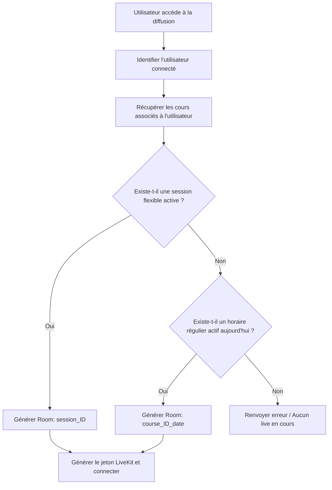

# Récapitulatif de la Mission : Conditions de démarrage et d'accès aux Lives

Ce document résume l'architecture et les règles de gestion d'accès aux diffusions en direct (LiveKit) pour la plateforme.

---

## 1. Objectif Global
Automatiser l'accès et la création des salons de diffusion (Rooms LiveKit) en se basant sur l'emploi du temps (planification temporelle). L'accès doit s'ouvrir et se fermer de manière autonome, que le cours soit en mode **flexible** ou **régulier**.

---

## 2. Règles de Gestion et d'Accès

### A. Marge de Temps (Créneau d'Accès)
Pour chaque cours ou session en direct, l'accès est autorisé dans un intervalle de temps précis :
* **Ouverture :** 10 minutes avant l'heure de début officielle.
* **Fermeture :** 10 minutes après l'heure de fin officielle (Calculée via la durée pour les cours flexibles, et via `heure_fin` pour les cours réguliers).

### B. Nommage Unique des Rooms LiveKit
Afin d'éviter tout chevauchement des flux et de préserver l'historique des salons, les noms de rooms LiveKit sont déterminés selon le type de planification :
1. **Mode Flexible (Sessions datées et uniques) :**
   * Format : `session_{session_id}`
   * *Exemple :* `session_42`
2. **Mode Régulier (Horaires hebdomadaires récurrents) :**
   * Format : `course_{course_id}_{date_du_jour}`
   * *Exemple :* Si le cours ID 3 a lieu un mardi, la room ce jour-là s'appellera `course_3_2026_05_21`. La semaine suivante, elle s'appellera `course_3_2026_05_28`.

---

## 3. Algorithme de Résolution de Session Active

Lorsqu'un utilisateur (professeur ou étudiant) se connecte à `/live-token` (ou accède à la page `/diffusion`) :

### Critères d'activité :
* **Flexible :**
  * `type` = `'live'`
  * Date/Heure actuelle comprise dans : `[date_heure - 10 min, date_heure + duree_minutes + 10 min]`
* **Régulier :**
  * `jour_semaine` = Jour actuel de la semaine (0 = Dimanche, 1 = Lundi, ..., 6 = Samedi)
  * Heure actuelle comprise dans : `[heure_debut - 10 min, heure_fin + 10 min]`
